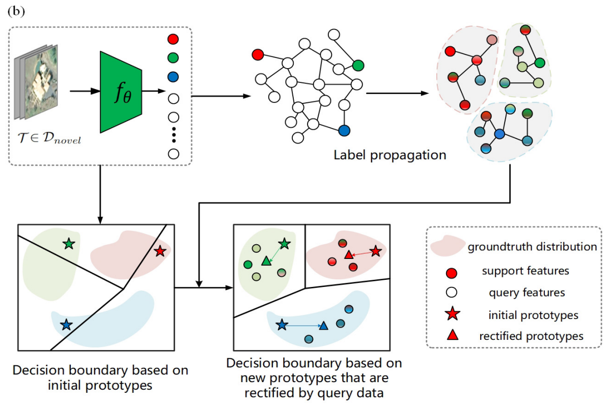

### Biography

Hello! I am Yu Wan, currently a master student in the Wuhan University. Previously, I received my bachelor degree (Software Engineering) from [School of Computer Science](https://cs.whu.edu.cn/) of Wuhan University. 

My research interests include Computer Vision and MultiModal Learning, with a focus on 2D/3D object detection, and few-show learning. 

### Education

### Wuhan University Master 2021.9 - Present

Remote Sensing Information Engineering College

### Wuhan University Bachelor 2017.9 - 2021.6

School of Computer Science

<table rules="none">
<tr>
<td>

</td>
<td>

<b>Few-Shot Scene Classification Using Auxiliary Objectives and Transductive Inference. </b>

JJi, H., Yang, H., Gao, Z., Li, C., <b>Wan, Y.</b>, & Cui, J.

IEEE Geoscience and Remote Sensing Letters, 2022, 19, 1-5.

</td>
</tr>
</table>    

### Internship

<table rules="none">
<tr>
<td>

</td>
<td>

ByteDance, Software Development Engineer, 2020.12 - 2021.03

Participate in building and developing component library of commercial department

</td>
</tr>
</table>    

<table rules="none">
<tr>
<td>

</td>
<td>

KE Holdings, Front-end Development Engineer, 2020.06 - 2020.11

Participated in the development of the online signing system for the trading business of the department

</td>
</tr>
</table>    

### Honors & Awards

- First-class Scholarship for Wuhan University Outstanding Undergraduate Students

- Second-class Scholarship for Wuhan University Outstanding Undergraduate Students

- Wuhan University Advanced Individual "Merit Student" title

- Silver Award of Hubei Province in the 6th "Internet +" College Students Innovation and Entrepreneurship Competition

- Wonderful Prize of "Citi Cup" Financial Application Innovation Competition

- Honorable Mention of Mathematical Contest in Modeling(MCM)

- Third prize of "Mathorcup" Mathematical Modeling Challenge

[My Resume](https://github.com/fengshiwest/fengshiwest.github.io/raw/master/_includes/about/resume_en.pdf)
