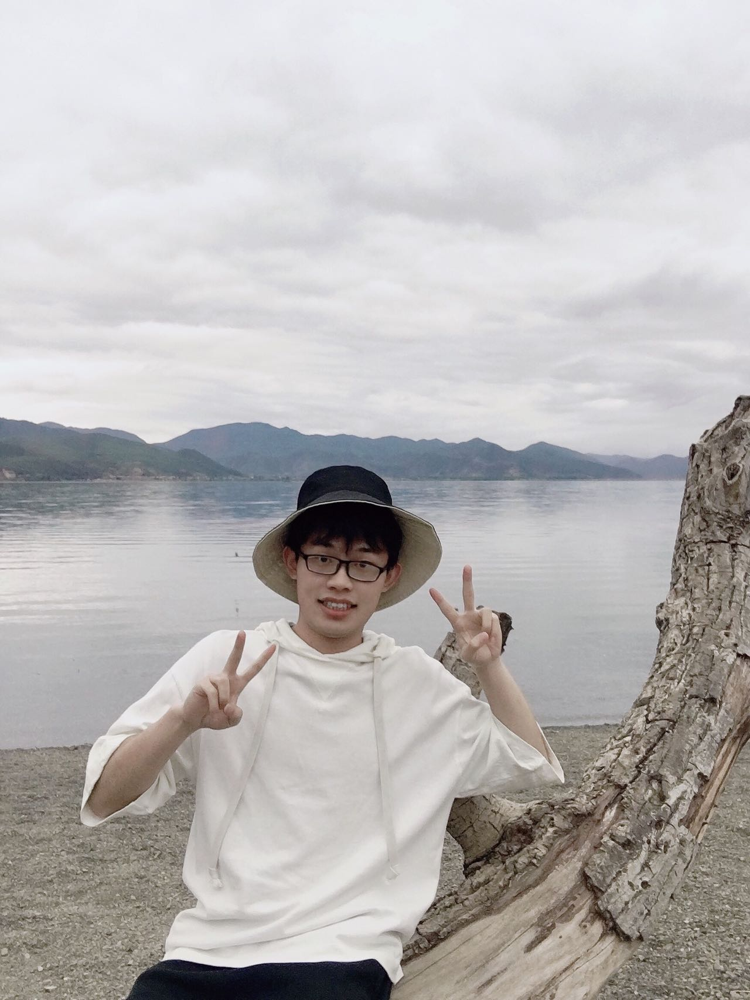
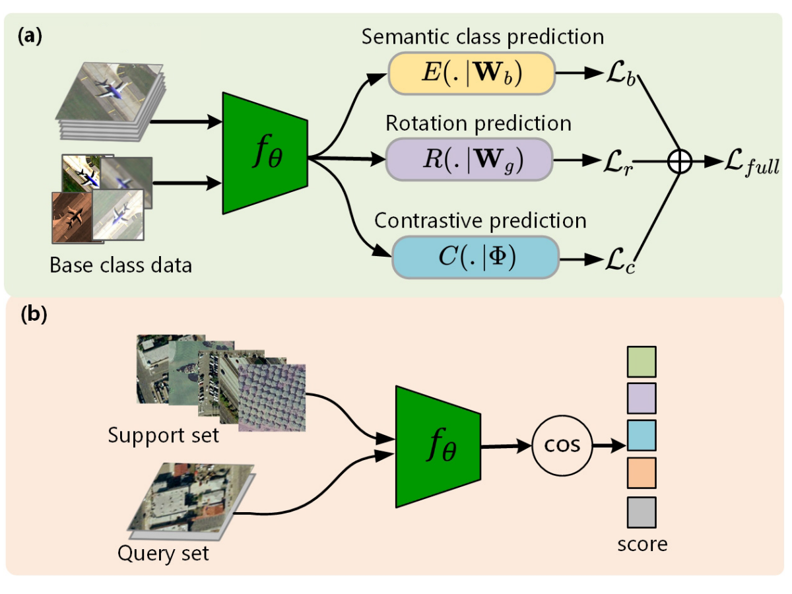
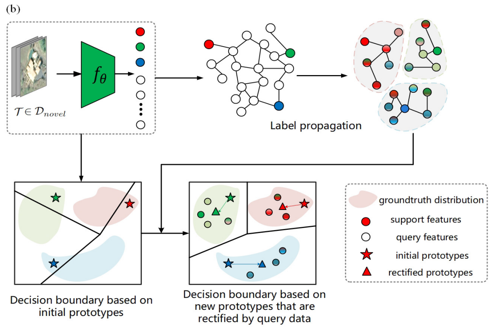

### Biography

<table>
<tr>

<td style="border:none" width="80%">

Hello! I am Yu Wan, currently a master student in the Wuhan University. Previously, I received my bachelor degree (Software Engineering) from School of Computer Science of Wuhan University. 

My research interests include Computer Vision and MultiModal Learning, with a focus on 2D/3D object detection, and few-show learning.

</td>

<td style="border:none" width="20%">

</td>

</tr>
</table>    

 

I'm looking for internships and job opportunities, here's my **[CV](https://github.com/fengshiwest/fengshiwest.github.io/raw/master/_includes/about/resume_en.pdf)**, look forward to hearing from you!

### Education

<table>
<tr>
<td style="border:none" width="15%">

</td>
<td style="border:none" width="85%">

Wuhan University, Master, 2021.9 - Present

Pattern Recognition and Intelligent System

</td>
</tr>
</table>    

<table rules="none">
<tr>
<td style="border:none"  width="15%">

</td>
<td style="border:none" width="85%">

Wuhan University, Bachelor, 2017.9 - 2021.6

Software Engineering

</td>
</tr>
</table>    

### Publications

<table rules="none">
<tr>
<td style="border:none" width="30%">

</td>
<td style="border:none"  width="70%">

<b>Few-shot scene classification of optical remote sensing images leveraging calibrated pretext tasks.</b>

Ji, H., Gao, Z., Zhang, Y., <b>Wan, Y.</b>, Li, C., & Mei, T. 

IEEE Transactions on Geoscience and Remote Sensing, 2022, 60: 1-13.

</td>
</tr>
</table>    

<table rules="none">
<tr>
<td style="border:none"  width="30%">

</td>
<td style="border:none"  width="70%">

<b>Few-Shot Scene Classification Using Auxiliary Objectives and Transductive Inference. </b>

JJi, H., Yang, H., Gao, Z., Li, C., <b>Wan, Y.</b>, & Cui, J.

IEEE Geoscience and Remote Sensing Letters, 2022, 19, 1-5.

</td>
</tr>
</table>    

### Internship

<table rules="none">
<tr>
<td style="border:none" width="15%">

</td>
<td style="border:none"  width="85%">

ByteDance, Software Development Engineer, 2020.12 - 2021.03

Participate in building and developing component library of commercial department

</td>
</tr>
</table>    

<table rules="none">
<tr>
<td style="border:none" width="15%">

</td>
<td style="border:none" width="85%">

KE Holdings, Front-end Development Engineer, 2020.06 - 2020.11

Participated in the development of the online signing system for the trading business of the department

</td>
</tr>
</table>

### Honors & Awards

- First-class Scholarship for Wuhan University Outstanding Undergraduate Students

- Second-class Scholarship for Wuhan University Outstanding Undergraduate Students

- Wuhan University Advanced Individual "Merit Student" title

- Silver Award of Hubei Province in the 6th "Internet +" College Students Innovation and Entrepreneurship Competition

- Wonderful Prize of "Citi Cup" Financial Application Innovation Competition

- Honorable Mention of Mathematical Contest in Modeling(MCM)

- Third prize of "Mathorcup" Mathematical Modeling Challenge